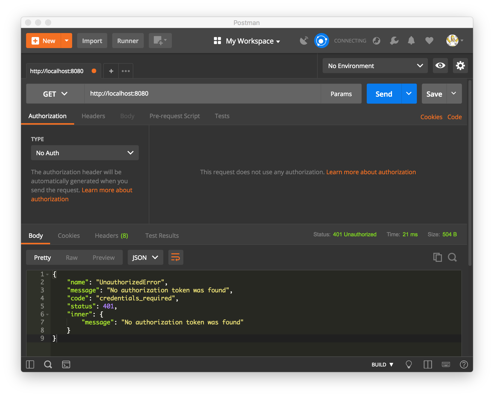

## JSON Web Token Authentication
Created two examples of using authentication method JSON Web Tokens following tutorials:
- <b>[Using JSON Web Token for Authentication](https://hptechblogs.com/using-json-web-token-for-authentication/)</b>
-- Trying to access protected api without authorization token
-- Logging in with right credentials
-- Accessing protected route with authorization token
- <b>[JSON Web Token Authentication in React and react-router](https://hptechblogs.com/using-json-web-token-react/)</b>
-- Create a Authentication Service Login Page
-- Use Higer Order Component for Authentication Guard to protect our home page
-- Test the App with Chrome development tool

Credit to [Harshit Pant](https://github.com/pantharshit00).

#### Installation
To run these projects you will need to download it onto your local machine and install all dependencies.
Navigate inside the folder and install all dependencies by entering the following command on your terminal window:
```bash
npm install
```
Finally to run the server enter the following command in your terminal window:
```bash
# Example 1: Using JSON Web Token for Authentication
node server.js
# Example 2: JSON Web Token Authentication in React and react-router
npm start
```
This will run the server, open [http://localhost:8080](http://localhost:8080) to view it in the browser.

If you want to end the process hold `control` and press `c` in mac, if you are not using mac hold `ctrl` and press `c`.

---

#### Example 1: Using JSON Web Token for Authentication
- [x] Trying to access protected api without authorization token

- [x] Logging in with right credentials

- [x] Accessing protected route with authorization token


#### Example 2: JSON Web Token Authentication in React and react-router
- [x] Create a Authentication Service Login Page

- [x] Use Higer Order Component for Authentication Guard to protect our home page

- [x] Test the App with Chrome development tool

